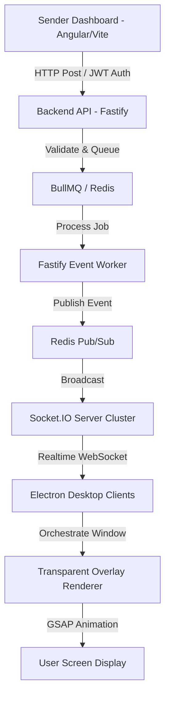

# Agent Workspace State & Execution Log (`agent.md`)

This file tracks the active role, architectural decisions, and current execution state for the **Enterprise Realtime Animated Notification System**.

---

## 1. Agent Role & Context
As a high-powered development agent, we are implementing the full monorepo stack:
- **Backend API & WebSocket Server** (`/apps/backend`)
- **Electron Desktop Application** (`/apps/electron`)
- **Sender Dashboard UI** (`/apps/sender-dashboard`)
- **Shared Contracts & Packages** (`/packages/...`)

---

## 2. System Architecture & Tech Stack



### Stack Details:
- **Backend**: Node.js + Fastify + Socket.IO + Redis + PostgreSQL + BullMQ + Pino logging.
- **Electron App**: Electron Main Process (tray, sockets, reconnects) + Renderer Process (GSAP animation, transparent overlays).
- **Sender Dashboard**: Angular / React / Vite + CSS variables.
- **Shared Contracts**: Unified WebSocket events, validation schemas, and types.

---

## 3. Core Architectural Rules

### A. Reliability First
- **Ephemerality**: Notifications must carry `expiresAt` (expiry metadata).
- **Zero Replay Spam**: If a connection recovers (e.g., sleep wake, network drop), it must ignore and discard any expired notifications.
- **Exponential Backoff**: Reconnection retries must follow `1s -> 2s -> 5s -> 10s -> 30s -> 60s` with jitter to avoid reconnect storms.
- **Heartbeat**: Pings sent every 20 seconds, reconnecting immediately if a timeout occurs.
- **Redundancy**: Use Redis Pub/Sub to coordinate broadcasts across multiple Socket.IO server instances.

### B. Desktop App Overlay Rules
- **Non-blocking overlays**: Transparent, frameless, always-on-top, skip-taskbar window overlays.
- **Lifecycle**: Create overlay window on notification receipt $\rightarrow$ Run animation $\rightarrow$ Auto-dismiss $\rightarrow$ Destroy overlay to avoid memory leaks.
- **Mute / Sound controls**: Local configurations for optional audio overlays, ESC key to dismiss current overlays.

### C. Folder Structure Checklist
```text
/
├── apps/
│   ├── backend/                # Fastify and Socket.IO servers
│   ├── electron/               # Electron application code
│   └── sender-dashboard/       # Sender dashboard UI
├── packages/
│   ├── shared-types/           # Shared models and payload schemas
│   ├── shared-utils/           # Shared utility functions
│   ├── socket-contracts/       # Event registries and contract validation
│   └── theme-engine/           # Animation config maps (GSAP)
├── context/
│   ├── backend-context.md
│   ├── electron-context.md
│   ├── animation-context.md
│   ├── frontend-context.md
│   ├── devops-context.md
│   └── qa-context.md
├── docs/                       # Technical specs and user guides
├── tests/                      # Chaos, integration, and performance tests
├── agent.md                    # Active agent workspace state (this file)
└── package.json                # Root workspaces configuration
```

---

## 4. Development Phases & Current Status

- [x] **Phase 1: Foundation & Connectivity**
  - [x] Set up Monorepo workspace (npm/yarn workspaces).
  - [x] Initialize `/packages/shared-types` & `/packages/socket-contracts`.
  - [x] Build core Backend API (Fastify) with Socket.IO server setup.
  - [x] Setup basic Electron shell that connects to the Socket.IO server.
  - [x] Implement handshake and basic heartbeats.
- [x] **Phase 2: Reliable Messaging & Queues**
  - [x] Add Redis, PostgreSQL, and BullMQ integration to backend.
  - [x] Implement notification dispatch API endpoint on backend.
  - [x] Implement notification expiry mechanism (TTL) and storage.
  - [x] Write connection recovery / reconnect handler.
- [ ] **Phase 3: Animation Engine & Themes**
  - Implement transparent background overlay in Electron.
  - Set up `/packages/theme-engine` with GSAP animations.
  - Implement basic theme behaviors (Airplane carrying banner, Running cat, Meme mode).
  - Configure ESC dismiss key handler.
- [ ] **Phase 4: Reliability Hardening**
  - Implement exponential backoff + jitter in Electron.
  - Handle machine suspend / resume lifecycle.
  - Add duplicate packet checking (dedupe cache).
  - Admin controls: Global mute, `STOP_NOTIFICATION` broadcast.
- [ ] **Phase 5: UX Polish & Observability**
  - Connect Sender Dashboard (Vite-based app) to backend.
  - Implement User settings (mute, custom display duration).
  - Integrate Pino logging on backend and Electron main process.
  - Implement client delivery ACKs and backend performance/analytics telemetry.

---

## 5. Context Files Tracking
As required by Section 22 of the Blueprint, we will initialize and maintain files in the `/context` directory to preserve structural alignment for downstream developers/agents.
- [x] `context/backend-context.md`
- [x] `context/electron-context.md`
- [ ] `context/animation-context.md`
- [ ] `context/frontend-context.md`
- [ ] `context/devops-context.md`
- [ ] `context/qa-context.md`
